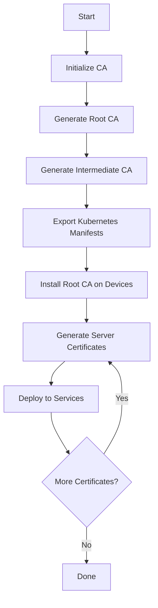

# Certificate Authority Generator

A comprehensive bash script for generating and managing your own Certificate Authority (CA) infrastructure for home labs, development environments, and Kubernetes clusters.

## Table of Contents

- [Overview](#overview)
- [Features](#features)
- [Requirements](#requirements)
- [Quick Start](#quick-start)
- [Certificate Architecture](#certificate-architecture)
- [Usage](#usage)
- [Installation Guides](#installation-guides)
  - [Windows](#windows)
  - [Linux](#linux)
  - [macOS](#macos)
  - [Android](#android)
  - [Kubernetes cert-manager](#kubernetes-cert-manager)
- [Workflow](#workflow)
- [Security Best Practices](#security-best-practices)
- [Troubleshooting](#troubleshooting)

---

## Overview

This tool creates a complete Certificate Authority infrastructure with:
- **Root CA** - The trust anchor (stored offline, 50 years validity)
- **Intermediate CA** - Used for daily certificate signing (25 years validity)
- **Server Certificates** - For TLS/HTTPS services (1 year validity)
- **Kubernetes Integration** - Automatic cert-manager integration

### Why Use This?

- Complete control over your certificate infrastructure
- No external dependencies - works offline
- Kubernetes native - integrates with cert-manager
- Production-ready - follows industry best practices
- Cost-free - no need for commercial CAs in development  

---

## Features

- **Two-tier CA hierarchy** (Root + Intermediate)
- **Automatic certificate chain generation**
- **Subject Alternative Names (SAN)** support
- **Kubernetes cert-manager** ready-to-use manifests
- **Prevents accidental CA regeneration**
- **Cross-platform** CA installation guides
- **Colored terminal output** for better readability
- **Configurable** via `cert.conf` file

---

## Requirements

### Linux/macOS:
```bash
# Required
- bash
- openssl
- base64

# Check if installed:
which openssl base64
```

### Windows:
```powershell
# Option 1: WSL (Windows Subsystem for Linux)
wsl --install

# Option 2: Git Bash
# Download from: https://git-scm.com/download/win

# Option 3: Cygwin
# Download from: https://www.cygwin.com/
```

---

## Quick Start

### 1. Initialize Certificate Authority

```bash
# Interactive mode (recommended for first time)
./cert_generator.sh

# Select option 1: Initialize CA (Root + Intermediate)
# You will be prompted to set passwords for CA keys
```

### 2. Generate Server Certificate

```bash
# CLI mode (fast)
./cert_generator.sh server "myapp.example.com" "myapp.example.com,www.myapp.example.com"

# Interactive mode
./cert_generator.sh
# Select option 2: Generate Server Certificate
```

### 3. Install Root CA to Your System

See [Installation Guides](#installation-guides) below.

---

## Certificate Architecture

```
┌─────────────────────────────────────────┐
│         Root CA (Self-Signed)           │
│  Validity: 50 years                     │
│  Key Size: 4096 bit RSA                 │
│  Storage: OFFLINE (secure location)     │
└──────────────────┬──────────────────────┘
                   │
                   │ Signs
                   ▼
┌─────────────────────────────────────────┐
│      Intermediate CA (Signed by Root)   │
│  Validity: 25 years                     │
│  Key Size: 4096 bit RSA                 │
│  Usage: Daily certificate signing       │
└──────────────────┬──────────────────────┘
                   │
                   │ Signs
                   ▼
┌─────────────────────────────────────────┐
│       Server Certificates               │
│  Validity: 1 year                       │
│  Key Size: 2048 bit RSA                 │
│  Usage: TLS/HTTPS services              │
└─────────────────────────────────────────┘
```

### Why Two-Tier Architecture?

| Aspect | Root CA | Intermediate CA |
|--------|---------|-----------------|
| **Security** | Stored offline | Used online |
| **Compromise** | Catastrophic | Recoverable |
| **Rotation** | Never (or very rare) | Can be rotated |
| **Usage** | Signs Intermediate only | Signs server certs |
| **Best Practice** | ✅ Industry standard | ✅ Recommended |

---

## Usage

### Command Line Interface (CLI)

```bash
# Initialize CA infrastructure
./cert_generator.sh init

# Generate server certificate
./cert_generator.sh server <common-name> <dns-names>

# Example: Single domain
./cert_generator.sh server "api.example.com" "api.example.com"

# Example: Multiple domains
./cert_generator.sh server "app.example.com" "app.example.com,www.app.example.com"

# Example: Wildcard certificate
./cert_generator.sh server "example.com" "example.com,*.example.com"

# Export Kubernetes manifests
./cert_generator.sh k8s-export
```

### Interactive Mode

```bash
./cert_generator.sh

# Menu Options:
# 1. Initialize CA (Root + Intermediate)
# 2. Generate Server Certificate
# 3. Export to Kubernetes
# 4. View Certificate Info
# 5. Exit
```

### View Certificate Information

```bash
# View certificate details
openssl x509 -in certs/server/myapp.com/server.crt -noout -text

# Check certificate validity
openssl x509 -in certs/server/myapp.com/server.crt -noout -dates

# Verify certificate chain
openssl verify -CAfile certs/intermediate-ca/ca-chain.crt certs/server/myapp.com/server.crt
```

---

## Installation Guides

After generating your Root CA, install it on all devices that need to trust your certificates.

### Windows

#### Method 1: Certificate Manager (GUI)
1. Open `certmgr.msc` (Windows + R, type `certmgr.msc`)
2. Navigate to: **Trusted Root Certification Authorities** → **Certificates**
3. Right-click → **All Tasks** → **Import**
4. Select `certs/root-ca/root-ca.crt`
5. Click **Next** → **Finish**

#### Method 2: Command Line (Administrator)
```powershell
# Open PowerShell as Administrator
certutil -addstore -f "ROOT" certs\root-ca\root-ca.crt

# Verify installation
certutil -store ROOT | Select-String -Pattern "RootCA"
```

#### Method 3: Group Policy (Domain)
```powershell
# For domain-joined computers
# Copy certificate to network share
Copy-Item certs\root-ca\root-ca.crt \\server\share\

# Deploy via GPO:
# Computer Configuration → Policies → Windows Settings → 
# Security Settings → Public Key Policies → 
# Trusted Root Certification Authorities → Import
```

---

### Linux

#### Debian/Ubuntu
```bash
# Copy Root CA to system trust store
sudo cp certs/root-ca/root-ca.crt /usr/local/share/ca-certificates/homelab-root-ca.crt

# Update CA certificates
sudo update-ca-certificates

# Verify installation
ls -la /etc/ssl/certs/ | grep homelab

# Test with curl
curl -v https://myapp.example.com
```

#### RHEL/CentOS/Fedora
```bash
# Copy Root CA to system trust store
sudo cp certs/root-ca/root-ca.crt /etc/pki/ca-trust/source/anchors/homelab-root-ca.crt

# Update CA trust
sudo update-ca-trust

# Verify
trust list | grep -i "homelab"

# Test
curl -v https://myapp.example.com
```

---

### macOS

#### Method 1: Keychain Access (GUI)
1. Double-click `certs/root-ca/root-ca.crt`
2. Select **System** keychain (not Login)
3. Enter admin password
4. Find the certificate in Keychain Access
5. Double-click → **Trust** → Set to **Always Trust**

#### Method 2: Command Line
```bash
# Add to system keychain
sudo security add-trusted-cert -d -r trustRoot \
  -k /Library/Keychains/System.keychain \
  certs/root-ca/root-ca.crt

# Verify
security find-certificate -c "RootCA" -a

# Remove if needed
sudo security delete-certificate -c "RootCA" \
  /Library/Keychains/System.keychain
```

---

### Android

#### Method 1: Manual Installation
1. Copy `certs/root-ca/root-ca.crt` to phone (via USB, email, or cloud)
2. Go to **Settings** → **Security** → **Encryption & credentials**
3. Tap **Install a certificate** → **CA certificate**
4. Tap **Install anyway** (warning appears)
5. Browse and select `root-ca.crt`
6. Enter a name: "HomeLab Root CA"

#### Method 2: ADB Command Line
```bash
# Enable USB debugging on Android device
# Connect device via USB

# Push certificate to device
adb push certs/root-ca/root-ca.crt /sdcard/

# On device, install via Settings as above
```

#### Method 3: For App Development
```bash
# Add to Android app's network security config
# res/xml/network_security_config.xml
<?xml version="1.0" encoding="utf-8"?>
<network-security-config>
    <base-config>
        <trust-anchors>
            <certificates src="system" />
            <certificates src="user" />
        </trust-anchors>
    </base-config>
</network-security-config>

# Reference in AndroidManifest.xml
<application
    android:networkSecurityConfig="@xml/network_security_config">
</application>
```

**Note:** Android 7.0+ requires apps to explicitly trust user-installed certificates.

---

### Kubernetes cert-manager

#### Prerequisites
```bash
# Install cert-manager (if not already installed)
kubectl apply -f https://github.com/cert-manager/cert-manager/releases/download/v1.13.0/cert-manager.yaml

# Wait for cert-manager to be ready
kubectl wait --for=condition=available --timeout=300s \
  deployment/cert-manager -n cert-manager
```

#### Installation Steps

1. **Initialize CA and export Kubernetes manifests:**
```bash
./cert_generator.sh init
```

2. **Install CA to Kubernetes:**
```bash
cd certs/kubernetes
./install-to-k8s.sh
```

3. **Verify installation:**
```bash
# Check ClusterIssuer
kubectl get clusterissuer homelab-ca-issuer

# Check CA secret
kubectl get secret homelab-ca-secret -n cert-manager

# View secret details (base64 encoded)
kubectl describe secret homelab-ca-secret -n cert-manager
```

#### Usage in Kubernetes

**Option 1: Automatic via Ingress (Recommended)**
```yaml
apiVersion: networking.k8s.io/v1
kind: Ingress
metadata:
  name: myapp
  annotations:
    cert-manager.io/cluster-issuer: "homelab-ca-issuer"
spec:
  ingressClassName: nginx
  tls:
  - hosts:
    - myapp.example.com
    secretName: myapp-tls  # cert-manager creates this automatically
  rules:
  - host: myapp.example.com
    http:
      paths:
      - path: /
        pathType: Prefix
        backend:
          service:
            name: myapp
            port:
              number: 80
```

**Option 2: Manual Certificate Resource**
```yaml
apiVersion: cert-manager.io/v1
kind: Certificate
metadata:
  name: myapp-cert
  namespace: default
spec:
  secretName: myapp-tls-secret
  issuerRef:
    name: homelab-ca-issuer
    kind: ClusterIssuer
  commonName: myapp.example.com
  dnsNames:
    - myapp.example.com
    - www.myapp.example.com
  duration: 8760h  # 1 year
  renewBefore: 720h  # Renew 30 days before expiration
```

**Monitor Certificates:**
```bash
# List all certificates
kubectl get certificate -A

# Check certificate status
kubectl describe certificate myapp-cert

# View certificate details
kubectl get certificate myapp-cert -o yaml

# Check cert-manager logs
kubectl logs -n cert-manager -l app=cert-manager -f
```

---

## Workflow

### Complete Setup Workflow



### Step-by-Step Process

#### 1. Initial Setup (One-time)
```bash
# Clone or download this repository
cd /path/to/cert-generator

# Review and customize configuration
nano cert.conf

# Initialize CA infrastructure
./cert_generator.sh init

# IMPORTANT: Backup Root CA keys securely
cp -r certs/root-ca /secure/offline/location/
```

#### 2. Install Root CA Everywhere (One-time per device)
```bash
# Windows
certutil -addstore -f "ROOT" certs\root-ca\root-ca.crt

# Linux
sudo cp certs/root-ca/root-ca.crt /usr/local/share/ca-certificates/
sudo update-ca-certificates

# macOS
sudo security add-trusted-cert -d -r trustRoot \
  -k /Library/Keychains/System.keychain certs/root-ca/root-ca.crt

# iOS/Android: See detailed guides above
```

#### 3. Kubernetes Integration (One-time per cluster)
```bash
cd certs/kubernetes
./install-to-k8s.sh
```

#### 4. Generate Certificates (As needed)
```bash
# For each service/domain
./cert_generator.sh server "myapp.example.com" "myapp.example.com,www.myapp.example.com"

# Files created in: certs/server/myapp.example.com/
# - server.key (private key)
# - server.crt (certificate)
# - server-fullchain.crt (certificate + CA chain)
```

#### 5. Deploy Certificates

**For Web Servers (nginx, Apache):**
```nginx
# nginx configuration
server {
    listen 443 ssl;
    server_name myapp.example.com;
    
    ssl_certificate     /path/to/certs/server/myapp.example.com/server-fullchain.crt;
    ssl_certificate_key /path/to/certs/server/myapp.example.com/server.key;
    
    # Additional SSL settings
    ssl_protocols TLSv1.2 TLSv1.3;
    ssl_ciphers HIGH:!aNULL:!MD5;
}
```

**For Kubernetes (with cert-manager):**
```yaml
# Ingress automatically gets certificate
apiVersion: networking.k8s.io/v1
kind: Ingress
metadata:
  name: myapp
  annotations:
    cert-manager.io/cluster-issuer: "homelab-ca-issuer"
spec:
  tls:
  - hosts:
    - myapp.example.com
    secretName: myapp-tls
  rules:
  - host: myapp.example.com
    http:
      paths:
      - path: /
        backend:
          service:
            name: myapp
            port:
              number: 80
```

#### 6. Certificate Renewal
```bash
# Regenerate certificate (overwrites existing)
./cert_generator.sh server "myapp.example.com" "myapp.example.com"

# Or use cert-manager automatic renewal (Kubernetes)
# cert-manager automatically renews 30 days before expiration
```

---

## Security Best Practices

### Root CA Protection
✅ **DO:**
- Store Root CA private key (`root-ca.key`) offline after initial setup
- Use a strong passphrase (AES-256 encrypted)
- Keep multiple encrypted backups in different physical locations
- Use hardware security module (HSM) for production
- Limit access to Root CA to trusted administrators only

❌ **DON'T:**
- Never store Root CA on internet-connected systems
- Never remove passphrase protection
- Never share Root CA private key
- Never use Root CA for daily certificate signing

### Intermediate CA Management
✅ **DO:**
- Keep Intermediate CA online for daily use
- Use strong passphrase protection
- Regular backups
- Monitor certificate issuance
- Rotate every 5-10 years

### Server Certificates
✅ **DO:**
- Use strong key sizes (2048-bit minimum)
- Set appropriate validity periods (≤ 1 year)
- Include all needed SANs (Subject Alternative Names)
- Protect private keys (chmod 400)
- Rotate regularly

❌ **DON'T:**
- Don't use wildcard certificates unless necessary
- Don't reuse private keys
- Don't set overly long validity periods

### File Permissions
```bash
# Secure CA keys
chmod 400 certs/root-ca/root-ca.key
chmod 400 certs/intermediate-ca/intermediate-ca.key

# Secure server keys
chmod 400 certs/server/*/server.key

# Certificates can be readable
chmod 644 certs/root-ca/root-ca.crt
chmod 644 certs/intermediate-ca/intermediate-ca.crt
chmod 644 certs/server/*/server.crt
```

### Backup Strategy
```bash
# Backup entire CA structure
tar -czf ca-backup-$(date +%Y%m%d).tar.gz certs/

# Encrypt backup
gpg -c ca-backup-$(date +%Y%m%d).tar.gz

# Store in multiple locations
# - External drive (offline)
# - Secure cloud storage (encrypted)
# - Physical safe
```

---

## Troubleshooting

### Certificate Not Trusted in Browser

**Problem:** Browser shows "Not Secure" or certificate warning.

**Solutions:**
1. **Verify Root CA is installed:**
   ```bash
   # Windows
   certutil -store ROOT | findstr "RootCA"
   
   # Linux
   ls -la /etc/ssl/certs/ | grep homelab
   
   # macOS
   security find-certificate -c "RootCA" -a
   ```

2. **Check certificate chain:**
   ```bash
   openssl verify -CAfile certs/intermediate-ca/ca-chain.crt \
     certs/server/myapp.com/server.crt
   ```

3. **Restart browser** after installing Root CA

4. **Check certificate dates:**
   ```bash
   openssl x509 -in certs/server/myapp.com/server.crt -noout -dates
   ```

### Firefox Not Trusting Certificates

**Problem:** Firefox uses its own certificate store.

**Solution:**
1. Open Firefox → Settings → Privacy & Security
2. Scroll to **Certificates** → Click **View Certificates**
3. **Authorities** tab → **Import**
4. Select `certs/root-ca/root-ca.crt`
5. Check **Trust this CA to identify websites**
6. Click **OK**

### OpenSSL Errors During Generation

**Problem:** `unable to write 'random state'`

**Solution:**
```bash
# Create .rnd file
touch ~/.rnd
chmod 600 ~/.rnd

# Or set RANDFILE
export RANDFILE=~/.rnd
```

**Problem:** `unable to load CA private key`

**Solution:**
- Verify key file exists and is readable
- Check file permissions (should be 400)
- Ensure you have the correct passphrase

### Kubernetes cert-manager Issues

**Problem:** Certificate not created automatically.

**Solutions:**
1. **Check cert-manager is running:**
   ```bash
   kubectl get pods -n cert-manager
   ```

2. **Check ClusterIssuer:**
   ```bash
   kubectl describe clusterissuer homelab-ca-issuer
   ```

3. **Check Certificate resource:**
   ```bash
   kubectl describe certificate myapp-cert
   ```

4. **View cert-manager logs:**
   ```bash
   kubectl logs -n cert-manager -l app=cert-manager --tail=100
   ```

5. **Check CertificateRequest:**
   ```bash
   kubectl get certificaterequest
   kubectl describe certificaterequest <name>
   ```

### Certificate Expired

**Problem:** Certificate has expired.

**Solution:**
```bash
# Regenerate server certificate
./cert_generator.sh server "myapp.example.com" "myapp.example.com"

# In Kubernetes, delete Certificate to force renewal
kubectl delete certificate myapp-cert
kubectl apply -f myapp-cert.yaml
```

### Mobile Device Won't Trust Certificate

**iOS:** Ensure you've enabled trust in:
Settings → General → About → Certificate Trust Settings

**Android:** Some apps don't trust user-installed CAs on Android 7.0+.
Solution: Configure app's network security config (see Android section above).

---

## File Structure

```
.
├── cert_generator.sh          # Main script
├── cert.conf                  # Configuration file
├── README.md                  # This file
├── KUBERNETES_INGRESS_GUIDE.md # Kubernetes-specific guide
└── certs/                     # Generated certificates (created after init)
    ├── root-ca/
    │   ├── root-ca.key        # Root CA private key (PROTECT!)
    │   ├── root-ca.crt        # Root CA certificate
    │   ├── root-ca.cnf        # OpenSSL config
    │   ├── index.txt          # Certificate database
    │   └── serial             # Serial number tracking
    ├── intermediate-ca/
    │   ├── intermediate-ca.key      # Intermediate CA private key
    │   ├── intermediate-ca.crt      # Intermediate CA certificate
    │   ├── intermediate-ca.csr      # Certificate signing request
    │   ├── intermediate-ca.cnf      # OpenSSL config
    │   ├── ca-chain.crt            # Full certificate chain
    │   ├── index.txt
    │   └── serial
    ├── server/
    │   └── <domain>/
    │       ├── server.key          # Server private key
    │       ├── server.crt          # Server certificate
    │       ├── server.csr          # Certificate signing request
    │       ├── server.cnf          # OpenSSL config
    │       └── server-fullchain.crt # Full chain (server + intermediate + root)
    └── kubernetes/
        ├── ca-secret.yaml              # Kubernetes secret with CA
        ├── ca-issuer.yaml              # ClusterIssuer and Issuer
        ├── example-certificate.yaml    # Example Certificate resource
        ├── example-ingress-auto-tls.yaml # Example Ingress with auto TLS
        └── install-to-k8s.sh          # Installation script
```

---

## Configuration Reference

See `cert.conf` for all configurable options:

| Section | Parameter | Default | Description |
|---------|-----------|---------|-------------|
| `[root_ca]` | `validity_days` | 18250 | Root CA validity (50 years) |
| | `key_size` | 4096 | RSA key size in bits |
| `[intermediate_ca]` | `validity_days` | 9125 | Intermediate CA validity (25 years) |
| | `key_size` | 4096 | RSA key size in bits |
| `[server_cert]` | `validity_days` | 365 | Server cert validity (1 year) |
| | `key_size` | 2048 | RSA key size in bits |
| `[kubernetes]` | `enable_k8s_export` | true | Generate K8s manifests |
| | `namespace` | cert-manager | Namespace for CA secret |

---

## Contributing

Contributions are welcome! Please:
1. Fork the repository
2. Create a feature branch
3. Make your changes
4. Test thoroughly
5. Submit a pull request

---

## License

This project is provided as-is for educational and development purposes.

---

## Support

For issues and questions:
- Check the [Troubleshooting](#troubleshooting) section
- Review [Kubernetes Ingress Guide](KUBERNETES_INGRESS_GUIDE.md)
- Open an issue on the repository

---

## Changelog

### Version 1.0.0
- Initial release
- Root and Intermediate CA generation
- Server certificate generation
- Kubernetes cert-manager integration
- Cross-platform installation guides
- Automatic certificate chain creation
- Protection against accidental CA regeneration

---

**Remember:** Always backup your CA keys securely. Loss of the Root CA private key means you'll need to regenerate everything and reinstall on all devices.

